# System Architecture

This page describes the technical architecture of the MAMS (Multi-Agent Migration System) and the recommended SnapLogic implementation patterns for the migrated jobs.

## MAMS System Architecture

### Multi-Agent System Design

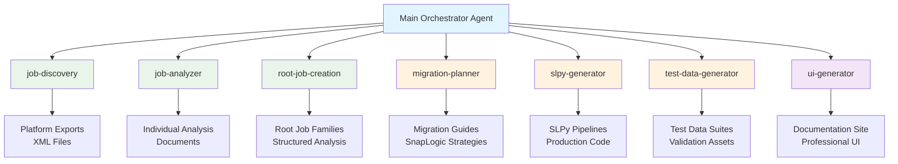

### Agent Workflow Pattern

The MAMS system follows a structured 7-phase workflow:

1. **Discovery Phase**: Lightweight scanning of platform exports
2. **Analysis Phase**: Detailed individual job analysis (one at a time)
3. **Synthesis Phase**: Job family creation from individual analyses
4. **Planning Phase**: SnapLogic migration strategy development
5. **Generation Phase**: Production-ready SLPy code generation
6. **Testing Phase**: Comprehensive test data suite creation
7. **Documentation Phase**: Professional UI and documentation generation

### Context Management Strategy

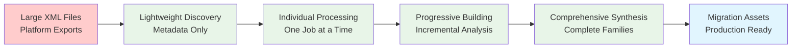

## SnapLogic Migration Architecture

### Overall Migration Strategy

The migration follows a **Hybrid Orchestration** approach, combining orchestration redesign with component modernization:

- **Ultra Tasks** for complex orchestration and routing
- **Pipeline Execute** patterns for sequential workflow control
- **Specialized Pipelines** for focused data processing tasks
- **Error Handling Frameworks** for comprehensive monitoring

### Bloomberg AUDNZD Architecture

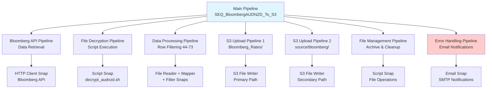

#### Bloomberg Technical Stack
| Component | DataStage Original | SnapLogic Implementation |
|-----------|-------------------|-------------------------|
| **Orchestration** | Sequence Job | Pipeline Execute Pattern |
| **API Integration** | Response_File job | HTTP Client Snap |
| **File Decryption** | Shell script (decrypt_audnzd.sh) | Script Snap |
| **Data Filtering** | Row filter transformer | Filter Snap (rows 44-73) |
| **S3 Upload** | External job calls | S3 File Writer Snaps |
| **Error Handling** | DSSendMail | Email Snap |
| **File Management** | DSU.ExecSH | Script Snap |

### INSPECTIONS CDC Architecture

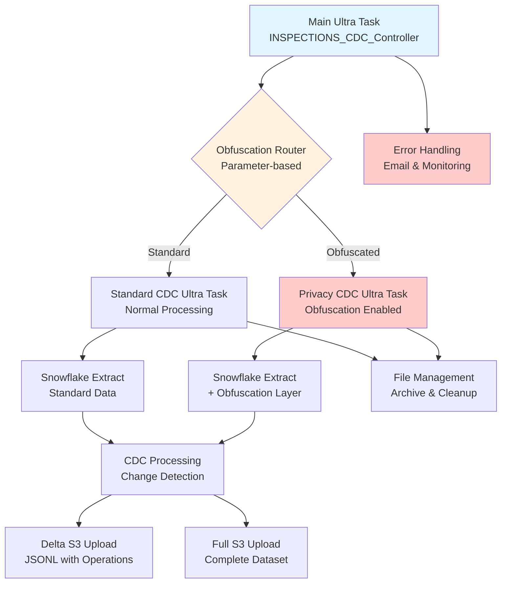

#### INSPECTIONS Technical Stack
| Component | DataStage Original | SnapLogic Implementation |
|-----------|-------------------|-------------------------|
| **Main Controller** | SEQ_INSPECTIONS_CDC_MSTR_MAIN | Ultra Task with routing |
| **CDC Orchestration** | 2 sequence jobs | 2 Ultra Tasks (standard/privacy) |
| **Data Extraction** | 2 parallel jobs | Snowflake Select Snaps |
| **Data Obfuscation** | Transformer stages | Advanced Mapper expressions |
| **Change Detection** | File comparison job | SCD/Diff Snap patterns |
| **S3 Upload** | 2 parallel jobs | S3 File Writer Snaps |
| **JSONL Conversion** | Column export | JSON Formatter Snap |
| **File Management** | DSU.ExecSH | Script Snap |

## Data Architecture Patterns

### Source-to-Target Mapping

#### Bloomberg Data Flow
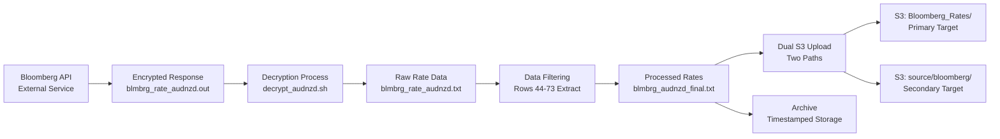

#### INSPECTIONS Data Flow
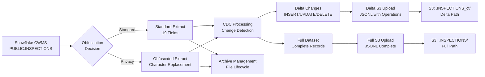

### Parameter Architecture

#### Parameter Flow Patterns
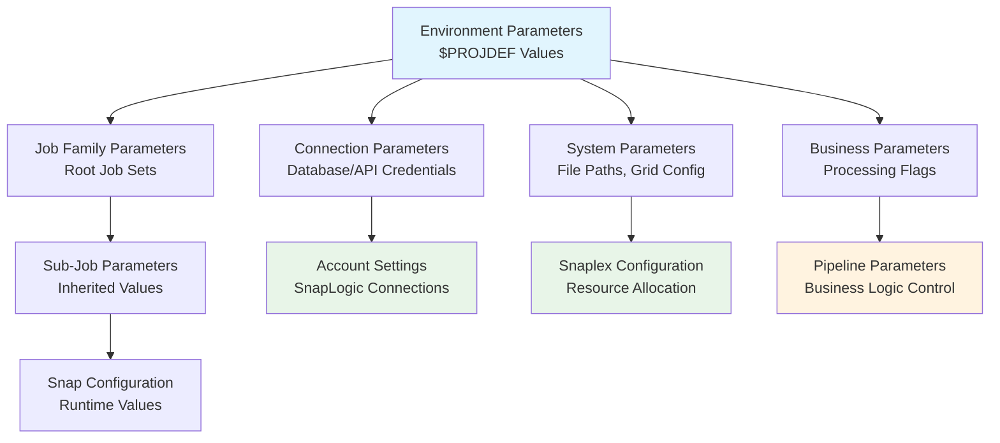

#### Key Parameter Mappings
| DataStage Parameter | SnapLogic Equivalent | Purpose |
|-------------------|---------------------|---------|
| `ps_Bloomberg` | Account Connection | Bloomberg API credentials |
| `CWMS_SF_Azure` | Account Connection | Snowflake database connection |
| `$APT_CONFIG_FILE` | Snaplex Configuration | Parallel processing setup |
| `$Enterprise_Path` | Pipeline Parameter | File system base path |
| `$Helios_S3_*` | Account Connection | S3 storage credentials |
| `$EmailServer` | Account Connection | SMTP notification server |
| `Delta` | Pipeline Parameter | Processing mode flag |
| `Obfuscation_IND` | Pipeline Parameter | Privacy processing flag |

## Security Architecture

### Security Implementation Patterns

#### Data Protection Strategy
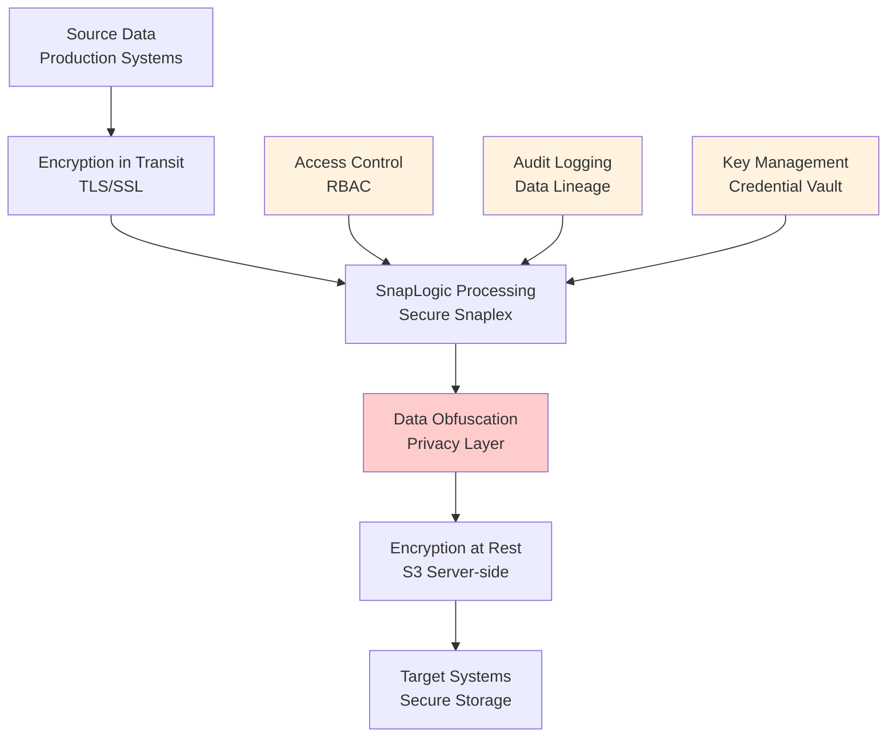

#### Security Controls by Component
| Component | DataStage Security | SnapLogic Security | Enhancement |
|-----------|-------------------|-------------------|-------------|
| **API Access** | Parameter sets | Account credentials | Encrypted vault storage |
| **Database** | Connection strings | Account connections | Certificate-based auth |
| **File Encryption** | Shell script | Script snap + vault | Centralized key management |
| **Data Obfuscation** | Transform stages | Expression library | Configurable patterns |
| **S3 Upload** | AWS keys in params | Account credentials | IAM role-based access |
| **Audit Trail** | Job logs | Pipeline monitoring | Enhanced data lineage |

## Performance Architecture

### Scalability Patterns

#### Resource Allocation Strategy
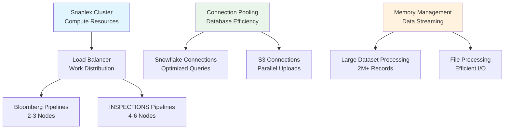

#### Performance Optimization Features
| Optimization Area | Bloomberg | INSPECTIONS | Implementation |
|------------------|-----------|-------------|----------------|
| **Parallel Processing** | API calls, dual S3 uploads | Snowflake pagination, CDC processing | Multiple pipeline instances |
| **Memory Management** | Stream processing | Large dataset streaming | Efficient data structures |
| **Connection Pooling** | HTTP/S3 connections | Snowflake/S3 connections | Shared connection pools |
| **Batch Processing** | File-based batching | Record-level batching | Configurable batch sizes |
| **Error Recovery** | Checkpoint/restart | Transaction boundaries | Ultra Task state management |

## Monitoring and Observability

### Monitoring Architecture
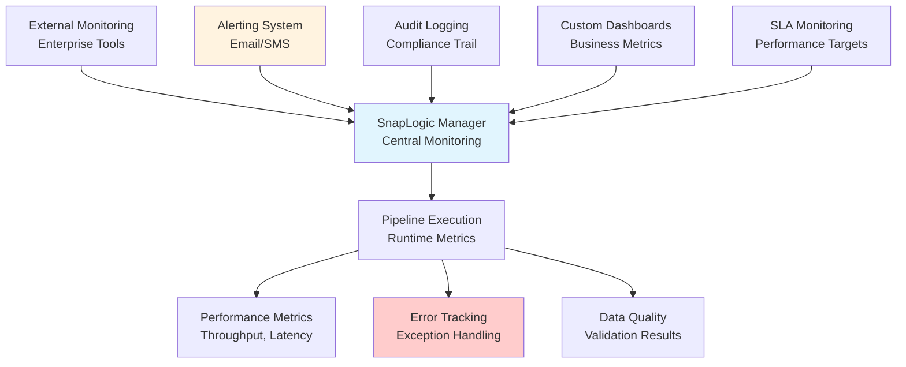

### Key Monitoring Metrics
| Metric Category | Bloomberg KPIs | INSPECTIONS KPIs | Threshold |
|-----------------|----------------|------------------|-----------|
| **Execution Time** | < 5 minutes | < 30 minutes | SLA compliance |
| **Data Volume** | ~1K records/day | 2M+ records/run | Volume validation |
| **Success Rate** | > 99.9% | > 99.5% | Error rate monitoring |
| **Data Quality** | 100% rate accuracy | 100% CDC accuracy | Quality validation |
| **Security Events** | Encryption success | Obfuscation compliance | Security monitoring |

## Deployment Architecture

### Environment Strategy
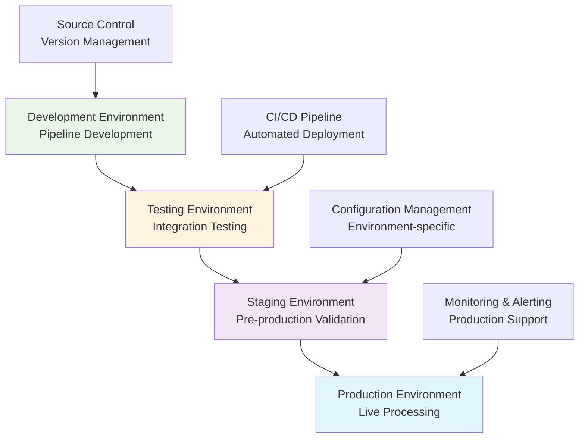

### Deployment Considerations
| Environment | Bloomberg Setup | INSPECTIONS Setup | Requirements |
|-------------|----------------|-------------------|--------------|
| **Development** | Sandbox API, Mock S3 | Test Snowflake, Mock S3 | Pipeline development |
| **Testing** | Production API, Test S3 | Staging Snowflake, Test S3 | End-to-end validation |
| **Staging** | Production API, Staging S3 | Production Snowflake, Staging S3 | Pre-production testing |
| **Production** | Live API, Production S3 | Production Snowflake, Live S3 | Business operations |

This architecture provides a robust, scalable, and secure foundation for migrating the DataStage jobs to SnapLogic while maintaining performance, security, and operational requirements.